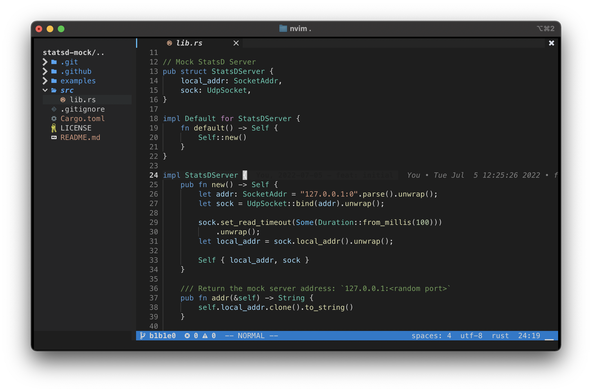

# duyet's NeoVim Configuration



### Usage

Make sure to backup your current `nvim` configuration by `mv ~/.config/nvim ~/.config/nvim.backup`.

Just clone this repo to your `~/.config` directory. 

```bash
git clone https://github.com/duyet/nvim ~/.config/nvim
```

### References

- <https://github.com/LunarVim/Neovim-from-scratch>

### License

MIT
