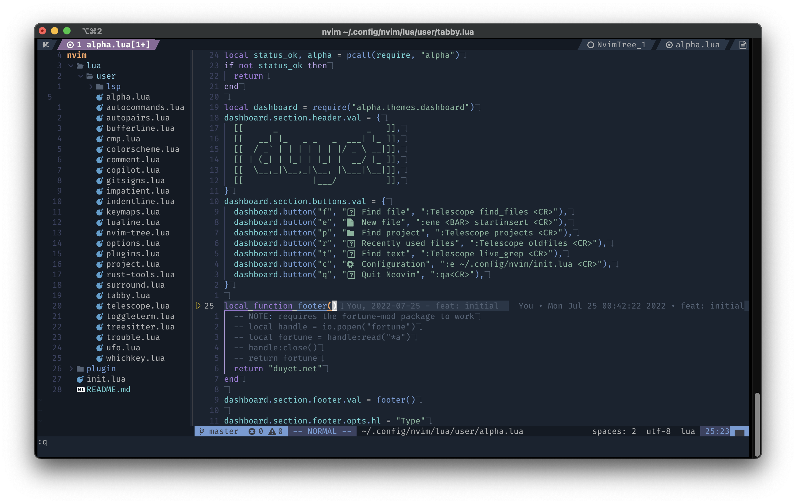
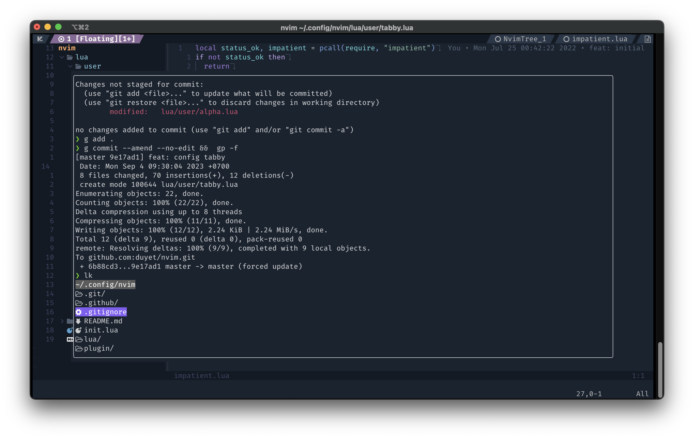
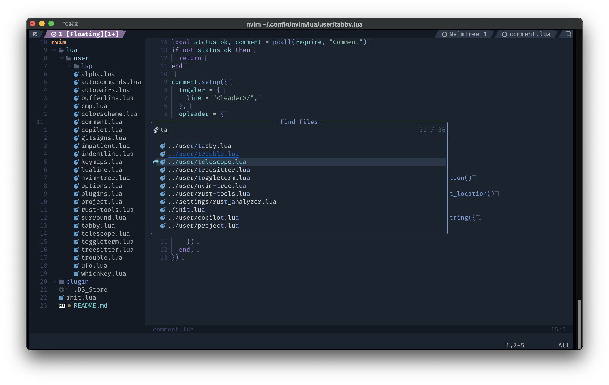
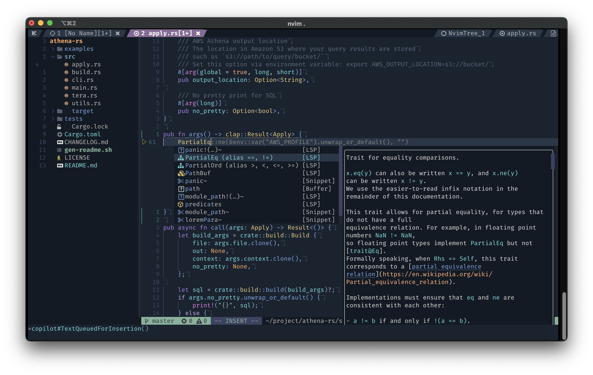
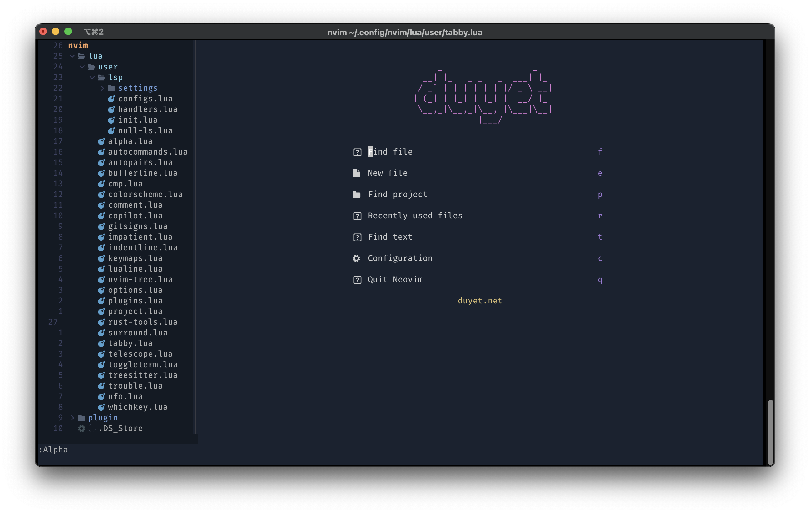

# duyet's NeoVim Configuration







### Usage

Make sure to backup your current `nvim` configuration by `mv ~/.config/nvim ~/.config/nvim.backup`.

Just clone this repo to your `~/.config` directory. 

```bash
git clone https://github.com/duyet/nvim ~/.config/nvim
```

### Default bindings

All the bindings are located here: [./lua/user/keymaps.lua](./lua/user/keymaps.lua)

### How to adding plugins 

Adding new plugins by adding to [./lua/user/plugins.lua](./lua/user/plugins.lua) 

```lua
  ...
  
  -- Surround
  use "kylechui/nvim-surround"

  use({ 'kevinhwang91/nvim-ufo', requires = 'kevinhwang91/promise-async' })
  use({ 'folke/trouble.nvim', requires = 'kyazdani42/nvim-web-devicons' })
```

For plugin configuration, I recommended to add a separated file under ./lua/user/

### References

- <https://github.com/LunarVim/Neovim-from-scratch>

### License

MIT
